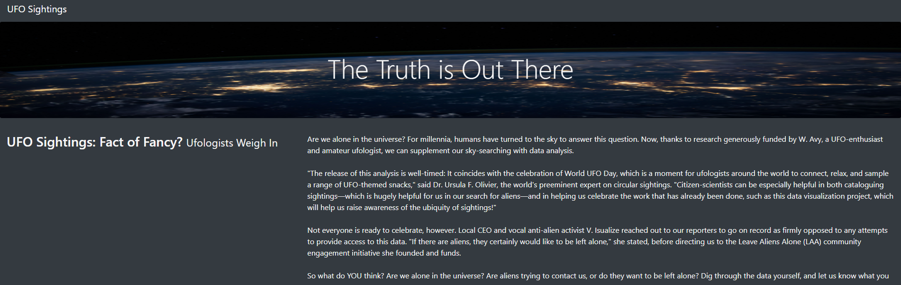
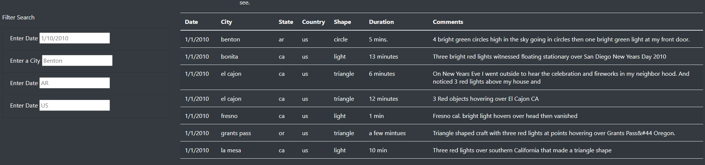

# UFOs Analysis

## Overview of Project
The reason for us to create an UFO sighting filteration system is to allow the user to filter the data based on when and where they are looking for analyze. We will explain how everything works and how to use our filteration system. 

## Page Details
After opening the webpage you'll be greated with the following page. 

If you want to filter the data scroll down tell you see a table with the following filter options on the left hand side

The filter options are case sensitive so be sure to only use lower case for the geographic locations and for the date make sure to format it as M/DD/YYYY. 

## Summary
This design gets the job done but to get the best experience we should make it less case sensitive allowing us to use upper and lower case letters. In addition to that make the date filter a calendar selection screen. Lastly we should reccomend inputs as someone is typing so they know what possible locations are in the data set to use. 
